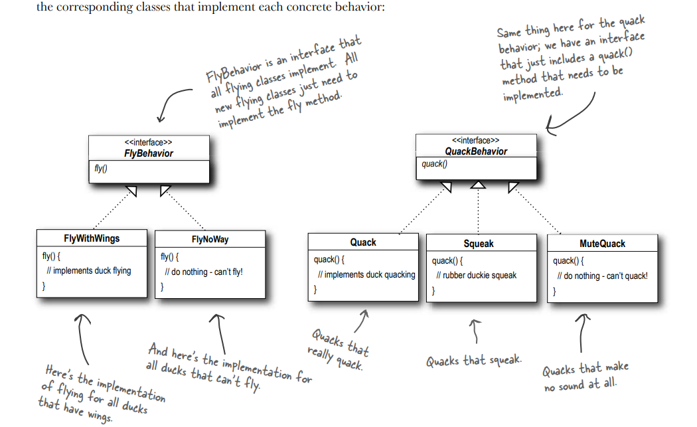
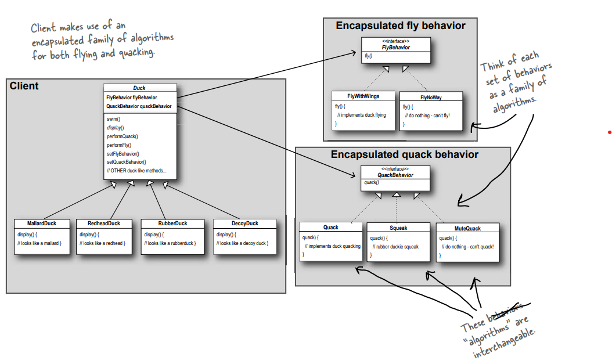

- SimUDuck app
  - Duck pond simulation game
  - can show a large variety of duck species swimming and making quacking sound
  - initial design
  - [initial design](./SimUDuck.png)
- We Need the ducks to fly
  - we can add fly() method to the base class
    - It won't be appropiate for some duck subclasses
    - Like a `RubberDuck` should not be able to fly
  - We can override `fly()` method in `RubberDuck` class to do nothing
  - Disadvantages of inheritance
    - Code is duplicated across subclasses
    - Runtime behaviour change is difficult
    - Hard to gain knowledge of all duck behaviours
    - Changes can unintentionally affect other ducks
  - How about an interface?
    - We can make a `Flyable()` interface with a `fly()` method.
    - That way only the ducks that are supposed to fly will implement that interface and will have fly method.
  - Problem with interface
    - it solves a part of problem, it completely destroys code reuse for those behaviours, so it creates a different maintainance nightmare
- The design principle we can use
  - `Identify the aspects of your application that vary and separate them them from what remains the same`
  - Take the parts that vary and encapsulate them, so that later you can alter or extend the parts that vary without affecting those that don't
  - Take what varies and "encapsulate" it so it won't affect the rest of our code
  - The result? Fewer unintended consequences from code changes and more flexibility in our system
- Separating what changes from what stays the same
  - `fly()` and `quack()` change frequently 
  - We are going to create two sets of classes, one for `fly` and one for `quack`
  - Each set of classes will hold all the implementations of the respective behaviour.
- Designing the Duck behaviours
  - we'd like to keep things flexible
  - we want to assign behaviours to the instances of Duck
  - we can change behaviour of a duck dynamically
    - we should include behaviour setter methods
  - **Design principle**
    - Program to an interface not an implementation
  - we'll use an interface to represent each behaviour and implementation of behaviour will implement one of those interface
  - We'll make a set of classes whose entire reason for living is to represent a behaviour and it's the behaviour class, rather than the Duck class, that will implement the behaviour interface
  - **"Program to an interface" really means "Program to a supertype"**
- Programming to an implementation
```java
Dog d = new Dog();
d.bark();
```
- Programming to an interface/supertype
```java
Animal animal = new Animal();
animal.makeSounnd();
```
- even better, rather than hardcoding the instantiation of the subtype into the code, adding the concrete implementation object at runtime
```java
a = getAnimal();
a.makeSound(); // we don't know what actual animal subtype is, al we care about is it responds to makeSound()
```
- Implementing the duck behaviour


  - With this design, other types of objects can reuse our fly and quack behaviours because these behaviours are no longer hidden away in our Duck classes
  - And we can add new behaviours without modifying any of our existing behaviour classes.

- Big Picture
  - Instead of thinking the duck behaviors as a set of behaviors, we'll start thinking of them as a family of algorithms

  - **HAS-A can be better than IS-A**
    - each duck has a `FlyBehaviour` and a `QuackBehaviour` to which it delegates flying and quacking
    - When we use put two classes together like this we are using composition
    - instead of inheriting their behaviour, the ducks get their behaviour by being composed with the right behaviour object
    - **Design Principle**
      - Favor composition over inheritance
- STRATEGY PATTERN
  - The strategy pattern defined a family of algorithms, encapsulated each one, and makes them interchangeable.
  - Strategy lets the algorithm vary independently from clients that use it.