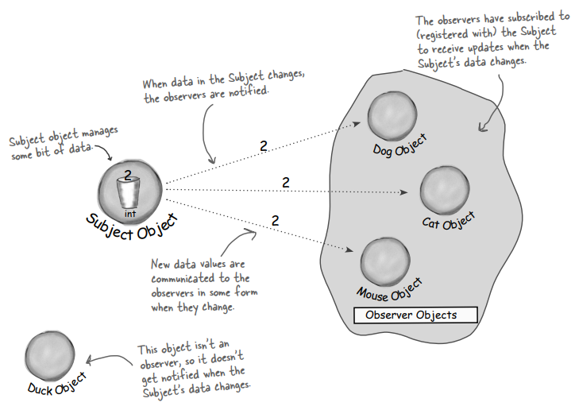
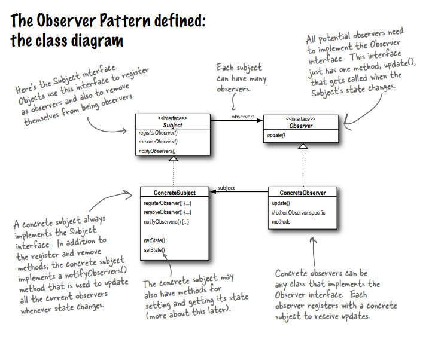

- Observer 
  - Publishers + Subscribers = Observer Pattern
  - 
  - The Observer pattern defines a one to many dependency between objects so that when one object changes states, all of it's dependents are notified and updated automatically.
  - Class Diagram
  - 
  - The Power of Loose Coupling
    - when two objects are loosely coupled, they can interact, but they typically have very little knowledge of each other.
    - Loosely coupled designs often give us a lot of flexibility.
    - Observer pattern is a great example of loose coupling
    - How Observer Pattern achieves loose coupling
      1. The only thing the subject knows about an observer is that it implements a certain interface. It doesn't need to know the concrete class of the observer.
      2. When can new observers at any time. Subject depends on the list of objects that implement the Observer interface.
      3. We never need to modify the subject to add new types of observers
      4. We can reuse subject or observer independently of each other.
      5. Changes to either subject or an observer will not affect the other.
    - Loosely coupled designs allow us to build flexible OO systems that can handle change because they minimize the interdependency between objects
    - 